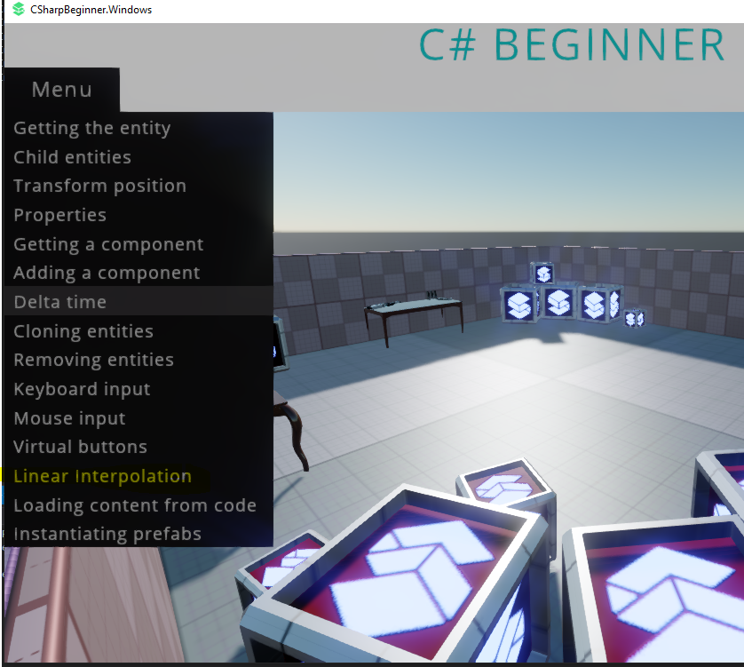

# stride3d 4.0.0 beta Tutorial

The "C# Beginner" tutorial for stride includes an option for _Linear interpolation_ which caused a crash.

Added [Sentry's SDK for .NET](https://github.com/getsentry/sentry-dotnet) to the project.

The bare minimum would be:

```csharp
// Add this line (the URL is personal, take yours at sentry.io)
using (SentrySdk.Init("https://5fd7a6cda8444965bade9ccfd3df9882@o117736.ingest.sentry.io/1188141"))
using (var game = new Game())
{
    game.Run();
}
```

To demo more options in the SDK, added some more context in the main class: [CSharpBeginner.Window\CSharpBeginnerApp.cs](CSharpBeginner.Windows%2fCSharpBeginnerApp.cs)

Sentry captures:


For some reason no line numbers on .NET Framework, but they are available on .NET Core.
The PDBs are generated so still need to figure out what's wrong with .NET providing the line


To repro the crash:

